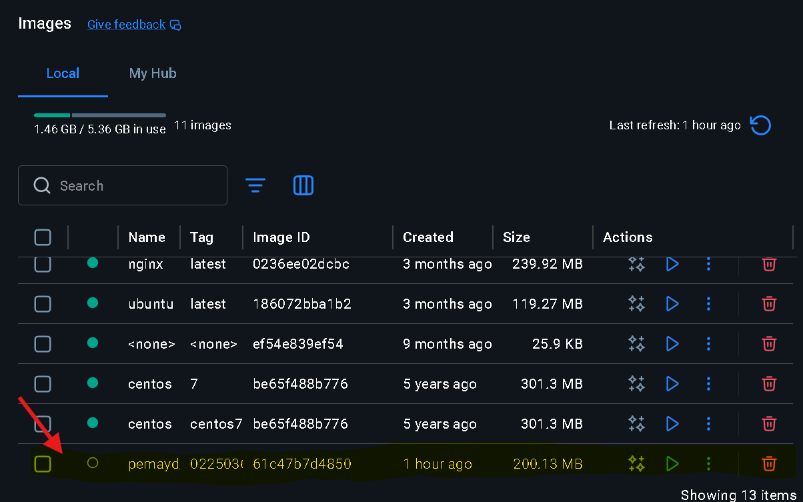
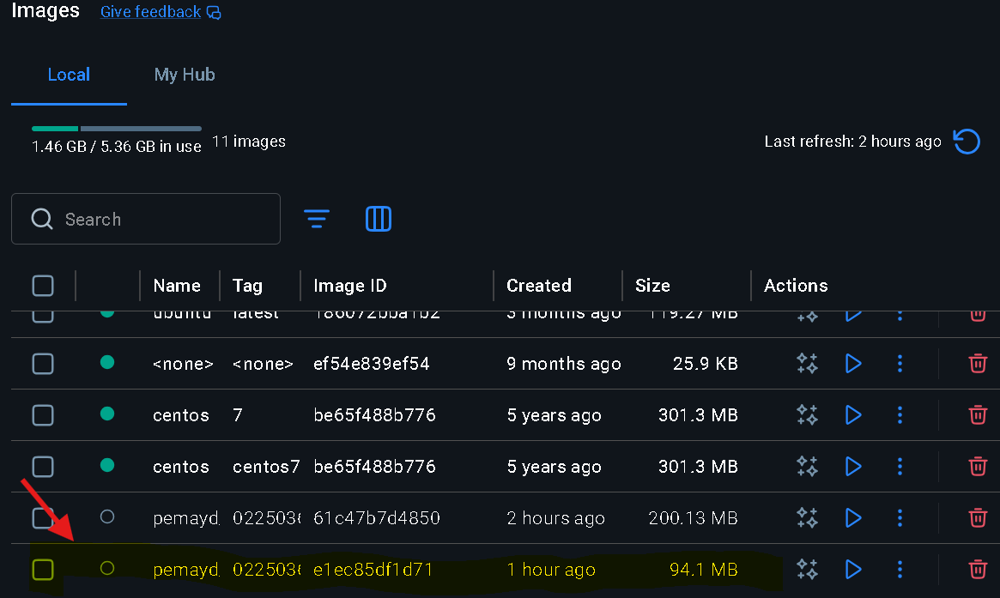
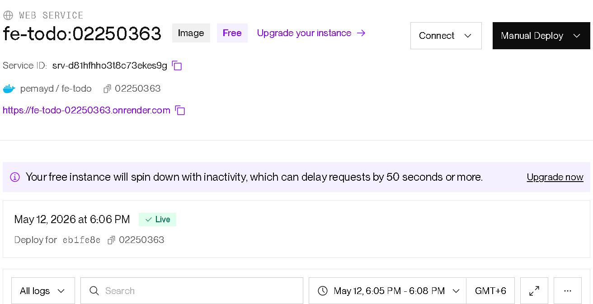
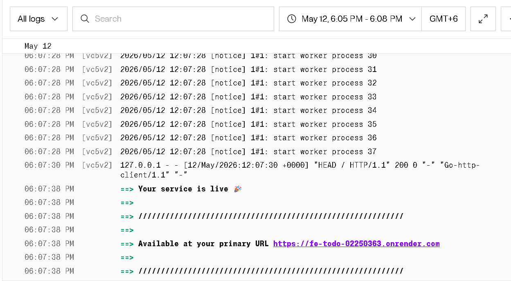
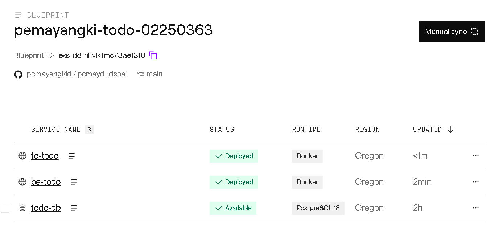

# PemaYangkiDorji_02250363_DSO101_A1

## Git repo
https://github.com/pemayangkid/pemayd_dsoa1.git

## Tech Stack
- Frontend: React
- Backend: Node.js + Express
- Database: PostgreSQL
- Deployment: Docker + Render.com

## Part A: Docker Hub Deployment
1. Built backend image: `docker build -t pemayd/be-todo:02250363 ./backend`
2. Pushed to Docker Hub: `docker push pemayd/be-todo:02250363`
3. 
4. Built backend image: `docker build -t pemayd/fe-todo:02250363 ./frontend`
5. Pushed to Docker Hub: `docker push pemayd/fe-todo:02250363`
6. 
7. Deployed on Render as existing Docker image
8. 
9. 
10. 

## Part B: Auto Deploy from Git
1. Added `render.yaml` blueprint
2. 
3. Connected GitHub repo to Render
4. Every push triggers a new build and deploy
5. 

## Live URLs
- Frontend: https://fe-todo-02250363.onrender.com
- Backend: https://be-todo-02250363.onrender.com