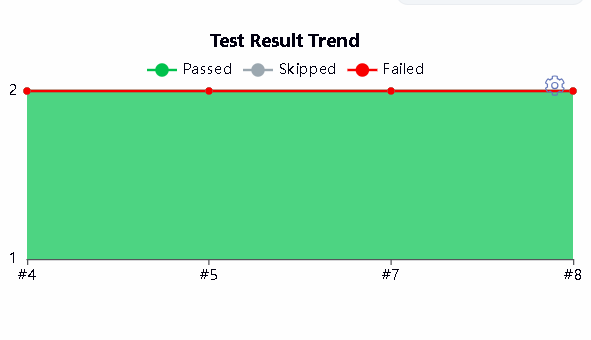
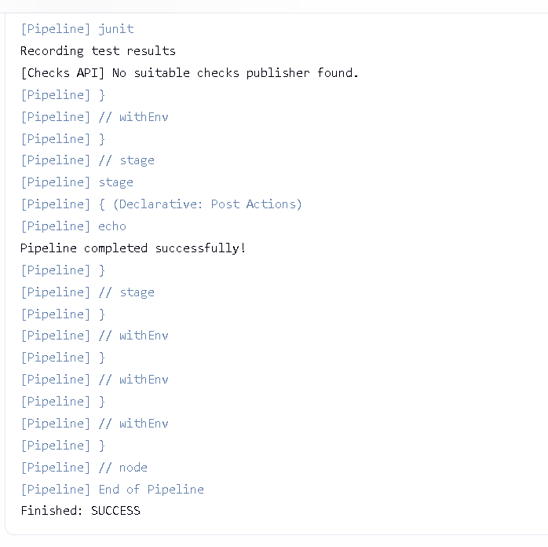
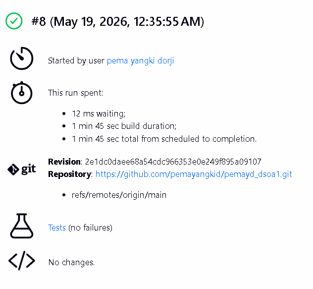

# PemaYangkiDorji_02250363_DSO101_A1

## Git Repository
https://github.com/pemayangkid/pemayd_dsoa1.git

## Tech Stack
- Frontend: React.js
- Backend: Node.js + Express
- Database: PostgreSQL
- Containerisation: Docker
- Deployment: Render.com

## Part A: Docker Hub Deployment

### Task 1 – Backend Dockerfile
Created `backend/Dockerfile`.

### Task 2 – Frontend Dockerfile
Created `frontend/Dockerfile` using a multi-stage build.

### Task 3 – Build and Push Images
Built for `linux/amd64` platform (required by Render):
docker build -t pemayd/be-todo:02250363 ./backend
docker push pemayd/be-todo:02250363

docker build -t pemayd/fe-todo:02250363 ./frontend
docker push pemayd/fe-todo:02250363

### Task 4 – PostgreSQL on Render
Created a managed PostgreSQL database on Render.

### Task 5 – Deploy on Render
Deployed both services using the Docker Hub images.

- Backend: New + → Web Service → Existing image → `pemayd/be-todo:02250363`
- Frontend: New + → Web Service → Existing image → `pemayd/fe-todo:02250363`

Set environment variables:
- Backend: `DATABASE_URL`, `PORT=5000`
- Frontend: `REACT_APP_API_URL=https://be-todo-02250363.onrender.com`

---

## Part B: Auto Deploy from Git

### Task 6 – render.yaml Blueprint
Created `render.yaml` in the repository root

### Task 7 – Connect GitHub to Render Blueprint
- Render → New + → Blueprint → connected GitHub repo
- Render detected `render.yaml` and deployed both services automatically

### Task 8 – Auto Deploy Verified
Every push to GitHub triggers a new build and deployment on Render.

## Live URLs
- Frontend: https://fe-todo-02250363.onrender.com
- Backend: https://be-todo-02250363.onrender.com

# Assignment 2 – CI/CD Pipeline with Jenkins

## Overview

This assignment extends the to-do list application from Assignment 1 by setting up a Jenkins CI/CD pipeline that automatically checks out code from GitHub, installs dependencies, runs a build step, and executes unit tests using Jest.

## Tools & Technologies Used
Jenkins | CI/CD automation (localhost:8080)
GitHub | Source code hosting 
Node.js (26.1.0) | JavaScript runtime
npm | Package management
Jest | Unit testing framework
jest-junit | JUnit XML report generation for Jenkins

## Pipeline Stages

The Jenkins pipeline consists of four stages:

**1. Checkout** – Pulls the latest code from the GitHub repository main branch.

**2. Install** – Runs `npm install` at the root level and `npm install` inside the backend folder to ensure all dependencies including Jest and jest-junit are available.

**3. Build** – Executes the build script. Since this is a plain Node.js backend with no transpilation needed, this stage echoes a confirmation message.

**4. Test** – Runs Jest unit tests inside the backend folder and generates a `junit.xml` report that Jenkins reads to display test results.

## How the Pipeline Was Configured

### Step 1 – Jenkins Setup
Jenkins was installed and run on Windows at `localhost:8080`. The following plugins were installed via Manage Jenkins → Plugins:
- NodeJS Plugin
- Pipeline
- GitHub Integration
- JUnit

Node.JS 26.1.0 was configured under Manage Jenkins → Tools → NodeJS installations with the name `NodeJS`.

### Step 2 – GitHub Repository
The to-do application from Assignment 1 was pushed to GitHub. A `.gitignore` file was created to exclude `node_modules/` and `junit.xml` from version control, ensuring Jenkins installs dependencies fresh on every build.

### Step 3 – GitHub Credentials in Jenkins
A GitHub Personal Access Token (PAT) was generated with `repo` and `admin:repo_hook` permissions. This token was added to Jenkins under Manage Jenkins → Credentials as a Username with Password credential with the ID `github-creds`.

### Step 4 – Pipeline Job
A new Pipeline job named `todo-pipeline` was created in Jenkins with:
- Definition: Pipeline script from SCM
- SCM: Git
- Repository URL: `https://github.com/pemayangkid/pemayd_dsoa1.git`
- Credentials: `github-creds`
- Branch: `*/main`
- Script Path: `Jenkinsfile`

### Step 5 – Unit Tests
Jest was configured in `backend/package.json` with jest-junit as a reporter to generate XML test reports. A test file `todo.test.js` was created in the backend folder with two tests covering adding and retrieving todo items.

## Challenges Faced

**1. node_modules accidentally pushed to GitHub**  
Initially, the entire `node_modules` folder was committed and pushed to GitHub. This was resolved by creating a `.gitignore` file and running `git rm -r --cached node_modules` to remove it from version control without deleting it locally.

**2. Merge conflicts during git pull**  
When pulling from GitHub to sync changes, merge conflicts occurred in `backend/package.json` and `backend/server.js`. These were resolved by keeping the local versions using `git checkout --ours`.

**3. Jest not recognized in Jenkins**  
Jenkins was running `npm test` from the root directory where Jest was not installed. The fix was to update the root `package.json` test script to change into the backend directory before running Jest, and to explicitly install backend dependencies as a separate step in the Jenkinsfile.

**4. JSX syntax error in frontend tests**  
Jest was picking up the React frontend test file (`App.test.js`) which uses JSX syntax not supported without Babel configuration. This was fixed by adding `testPathIgnorePatterns` in the Jest config to exclude the `frontend/` folder.

**5. Invalid package.json syntax**  
A JSON syntax error in the root `package.json` caused `npm install` to fail in Jenkins. This was debugged using `node -e "require('./package.json')"` locally and fixed by correcting the malformed JSON.

**6. Windows vs Linux shell commands**  
The Jenkinsfile examples in the assignment used `sh` commands (Linux). Since Jenkins was running on Windows, all shell commands had to use `bat` instead.

## Screenshots

> Insert the following screenshots in this section:

1. 

2. 

3. 

