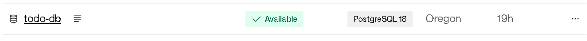
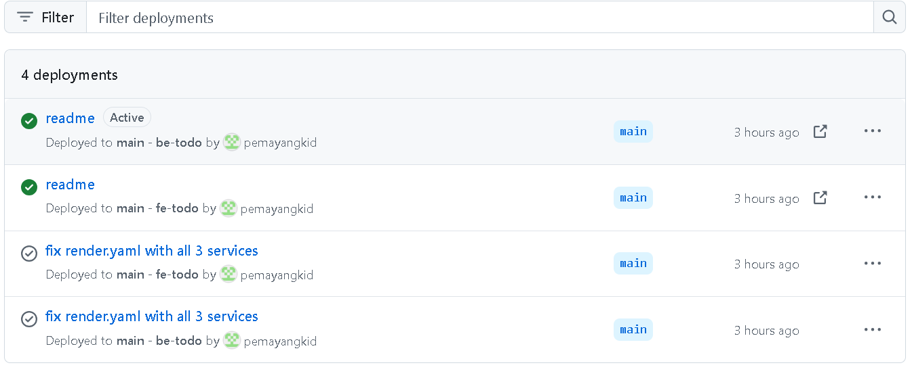

# PemaYangkiDorji_02250363_DSO101_A1

## Git Repository
https://github.com/pemayangkid/pemayd_dsoa1.git

## Tech Stack
- Frontend: React.js
- Backend: Node.js + Express
- Database: PostgreSQL
- Containerisation: Docker
- Deployment: Render.com

## Part A: Docker Hub Deployment

### Task 1 – Backend Dockerfile
Created `backend/Dockerfile`.

### Task 2 – Frontend Dockerfile
Created `frontend/Dockerfile` using a multi-stage build.

### Task 3 – Build and Push Images
Built for `linux/amd64` platform (required by Render):
docker build -t pemayd/be-todo:02250363 ./backend
docker push pemayd/be-todo:02250363

docker build -t pemayd/fe-todo:02250363 ./frontend
docker push pemayd/fe-todo:02250363

### Task 4 – PostgreSQL on Render
Created a managed PostgreSQL database on Render.

### Task 5 – Deploy on Render
Deployed both services using the Docker Hub images.

- Backend: New + → Web Service → Existing image → `pemayd/be-todo:02250363`
- Frontend: New + → Web Service → Existing image → `pemayd/fe-todo:02250363`

Set environment variables:
- Backend: `DATABASE_URL`, `PORT=5000`
- Frontend: `REACT_APP_API_URL=https://be-todo-02250363.onrender.com`

---

## Part B: Auto Deploy from Git

### Task 6 – render.yaml Blueprint
Created `render.yaml` in the repository root

### Task 7 – Connect GitHub to Render Blueprint
- Render → New + → Blueprint → connected GitHub repo
- Render detected `render.yaml` and deployed both services automatically

### Task 8 – Auto Deploy Verified
Every push to GitHub triggers a new build and deployment on Render.

## Live URLs
- Frontend: https://fe-todo-02250363.onrender.com
- Backend: https://be-todo-02250363.onrender.com
